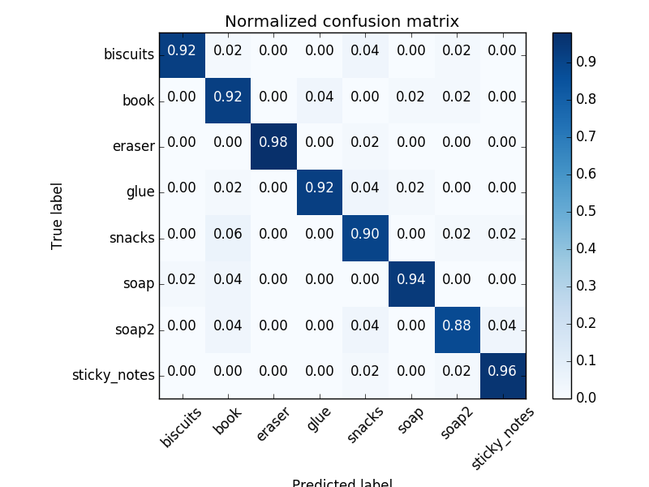
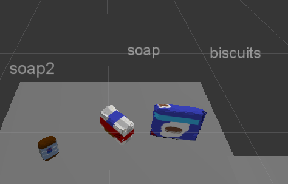
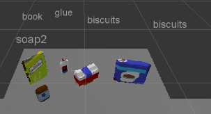
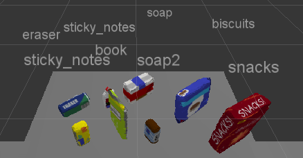

## Introduction

The goal for this project is to provide a robot with the necessary information in order for it to move objects on a table in front of it to bins located on either side.  The robot uses an RBGD camera, which captures a  color image, as well as depth information using infra-red illumination and detection.  After the objects are identified, a pick list is retrieved and the objects are moved to the bin assigned to them.

## Object Detection

The first step in object detection is to train a support vector machine to recognize the eight objects in various poses.  To do this, the objects are presented to the RGBD camera on a sensor stick as shown below.  Fifty poses are captured for each object.

The support vector machine is then trained with the caputured images and confusion matrices are calculated.  The first matrix below displays the raw count of identifications.  For example, the snacks was correctly identified forty five times and was confused as a book three times, as the soap2 one time, and as sticky notes one time.

The confusion matrix below is the same data but normalized and presented as percentages.

The task was to present the robot with three increasingly complicated test sets.

Below is the first test sets where the three objects are correctly detected.

Below is the second test set where the five objects are correctly detected.

Below is the third test set where seven of eight objects are correctly detected.  The glue, which is partially obscured by the book, is misidentified as a sticky note.

The positions of the objects and their destination positions are then calculated and presented to the robot and it performs the operation of picking up the object and moving it to the destination bin.  This data is also output to yaml files to verify the data was calculated successfully.

## Software

1.  Statistical Outlier Filtering
    The image has some noise than can be filtered out using a statistical outlier filter
    
2.  Voxel Grid Downsampling
    To reduce computational load, the 3d info is downsampled.
    
3.  PassThrough Filter
    The scene is isolated so only the table and objects are visible
    
4.  RANSAC Plane Segmentation
    The table is then located via RANSA plane segmentation.
    
5.  Extract inliers and outliers
    The object cloud (inliers) and tables (outliers) is then extracted seperately.
    
6.  Euclidean Clustering
    The object cloud is then seperated into clusters using euclidean clustering.
    
7.  Create Cluster-Mask Point Cloud to visualize each cluster separately
    Each cluster is assigned a color and then sent to Rviz for visualization.
    
8.  Classify the clusters

    Go through each cluster and perform the identification steps 9,10,11.
    

9. Compute the associated feature vector

    Each cluster is identfied by calculating histograms of the color information and normals.  The normals are vectors normal to the surface of the object and gives shape information.  

10. Make the prediction

    The histograms are concatenated and presented to the SVM predictor.

11. Add the detected object to the list of detected objects

12.  Call the mover function

    The list of detected objects is then presented to the mover function

## Mover Function
    
1.  Retrieve the pick list
2.  Look up the destination bins
3.  Calculate the object position
4.  Put the information into a yaml structure and add to the list.
5.  Call the pick_place_routine to perform the operation.

Spend some time at the end to discuss your code, what techniques you used, what worked and why, where the implementation might fail and how you might improve it if you were going to pursue this project further.  

